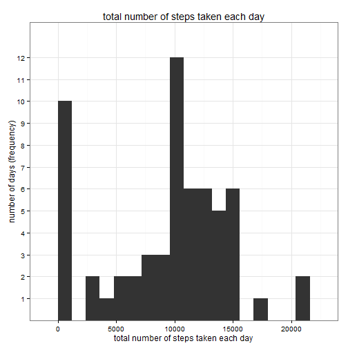
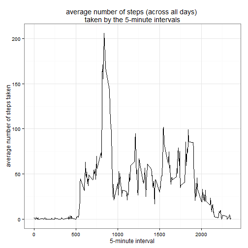
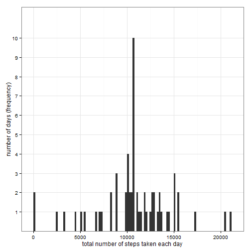
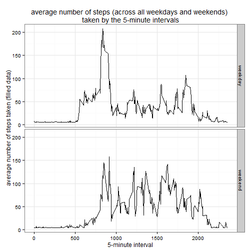

Reproducible Research: Assignment 1
==========================================

### Initial settings

```r
# Set the working directory to where the file is.
# setwd("...")
echo = TRUE
options(scipen = 1)
```
### Load and preprocess the data

```r
echo = TRUE
# dataset downloaded through the course website
# unzip(zipfile="repdata-data-activity.zip")
dt <- read.csv("./activity.csv")
str(dt)
```

```
## 'data.frame':	17568 obs. of  3 variables:
##  $ steps   : int  NA NA NA NA NA NA NA NA NA NA ...
##  $ date    : Factor w/ 61 levels "2012-10-01","2012-10-02",..: 1 1 1 1 1 1 1 1 1 1 ...
##  $ interval: int  0 5 10 15 20 25 30 35 40 45 ...
```

### What is mean total number of steps taken per day?
#### 1. Calculate the total number of steps taken per day
#### _**Please note: option 'na.rm=T' used throughout**_

```r
steps.total <- tapply(dt$steps, dt$date, FUN=sum, na.rm=TRUE)
```

#### 2. A histogram of the total number of steps taken each day

```r
library(ggplot2)
# qplot defaults to "histogram" if only x is specified.
qplot(steps.total, binwidth=1200,
      xlab="total number of steps taken each day",
      ylab="number of days (frequency)", 
      main="total number of steps taken each day") +
      theme_bw()+
      scale_y_discrete(breaks=c(1:20))
```

 

#### 3. Calculate and report the mean and median of the total number of steps taken per day

```r
## Mean of the total number of steps taken per day
steps.average <- mean(steps.total, na.rm=TRUE)
steps.average
```

```
## [1] 9354.23
```

```r
## Median of the total number of steps taken per day
steps.med <- median(steps.total, na.rm=TRUE)
steps.med
```

```
## [1] 10395
```
* _**Comment:**_
* _**The average of the total number of steps taken per day is 9354 and the median is 10395.**_

### What is the average daily activity pattern?
#### 1. Make a time series plot (i.e. type = "l") of the 5-minute interval (x-axis) and the average number of steps taken, averaged across all days (y-axis)

```r
library(ggplot2)
# calculate the average number of steps (across all days) taken by the 5-minute intervals
steps.average.interval <- aggregate(x=list(steps=dt$steps), by=list(interval=dt$interval), FUN=mean, na.rm=TRUE)
ggplot(data=steps.average.interval, aes(x=interval, y=steps)) +
    geom_line() +
    xlab("5-minute interval") +
    ylab("average number of steps taken") +
    labs(title="average number of steps (across all days) \ntaken by the 5-minute intervals") +
    theme_bw()
```

 

#### 2. Which 5-minute interval, on average across all the days in the dataset, contains the maximum number of steps?

```r
steps.average.top <- steps.average.interval[which.max(steps.average.interval$steps),]
steps.average.top
```

```
##     interval    steps
## 104      835 206.1698
```
* _**Comment:**_
* _**Interval no 835 contains the maximum number of steps (206) on average across all days.**_

### Imputing missing values
#### 1. Calculate and report the total number of missing values in the dataset (i.e. the total number of rows with NAs) 

```r
# number of rows with NAs in the dataset
sumna <- sum(is.na(dt$steps) | is.na(dt$date) | is.na(dt$interval))
sumna
```

```
## [1] 2304
```

```r
# number of rows with NAs per column
sum(is.na(dt$steps)); sum(is.na(dt$date)); sum(is.na(dt$interval))
```

```
## [1] 2304
```

```
## [1] 0
```

```
## [1] 0
```
* _**Comment:**_
* _**The total number of rows with NAs in the dataset is 2304.**_

#### 2. Devise a strategy for filling in all of the missing values in the dataset. 
* The strategy does not need to be sophisticated. 
* For example, you could use the mean/median for that day, or the mean for that 5-minute interval, etc.

```r
# Mean of steps taken per day
steps.average.date <- aggregate(x=list(steps.av=dt$steps), by=list(date=dt$date), FUN=mean, na.rm=TRUE)
# As shown below, there are a number of days with missing values for steps
steps.average.date$steps.av
```

```
##  [1]        NaN  0.4375000 39.4166667 42.0694444 46.1597222 53.5416667
##  [7] 38.2465278        NaN 44.4826389 34.3750000 35.7777778 60.3541667
## [13] 43.1458333 52.4236111 35.2048611 52.3750000 46.7083333 34.9166667
## [19] 41.0729167 36.0937500 30.6284722 46.7361111 30.9652778 29.0104167
## [25]  8.6527778 23.5347222 35.1354167 39.7847222 17.4236111 34.0937500
## [31] 53.5208333        NaN 36.8055556 36.7048611        NaN 36.2465278
## [37] 28.9375000 44.7326389 11.1770833        NaN        NaN 43.7777778
## [43] 37.3784722 25.4722222        NaN  0.1423611 18.8923611 49.7881944
## [49] 52.4652778 30.6979167 15.5277778 44.3993056 70.9270833 73.5902778
## [55] 50.2708333 41.0902778 38.7569444 47.3819444 35.3576389 24.4687500
## [61]        NaN
```

#### _**My strategy:**_
#### _**Fill in the missing values in the dataset with the month averages.**_
#### _**First, calculate the average number of steps taken per month.**_
#### _**Then, create a new dataset (equal to the original one).**_
#### _**Finally, populate the variable 'steps' in the new dataset with the month averages.**_

```r
# average number of steps taken per month
steps.average.month <- aggregate(x=list(steps.av=dt$steps), by=list(month=format(as.POSIXct(dt$date), "%m")), FUN=mean, na.rm=TRUE)
steps.average.month
```

```
##   month steps.av
## 1    10 37.45821
## 2    11 37.29123
```

#### 3. Create a new dataset that is equal to the original dataset but with the missing data filled in.

```r
# create a new dataset
dt.new <- dt
## update 'steps' column in the new dataset with the month averages
dt.new$steps <- ifelse(is.na(dt.new$steps) & (format(as.POSIXct(dt.new$date), "%m")==steps.average.month[1,1]),
                    steps.average.month[1,2],
                    ifelse(is.na(dt.new$steps) & (format(as.POSIXct(dt.new$date), "%m")==steps.average.month[2,1]),
                         steps.average.month[2,2],
                         dt.new$steps))
## average number of steps taken per day following the filling in of the missing values
steps.average.date.new <-aggregate(x=list(steps.av=dt.new$steps), by=list(date=dt.new$date), FUN=mean, na.rm=TRUE)
# missing values have been filled in with the month averages
steps.average.date.new$steps.av
```

```
##  [1] 37.4582136  0.4375000 39.4166667 42.0694444 46.1597222 53.5416667
##  [7] 38.2465278 37.4582136 44.4826389 34.3750000 35.7777778 60.3541667
## [13] 43.1458333 52.4236111 35.2048611 52.3750000 46.7083333 34.9166667
## [19] 41.0729167 36.0937500 30.6284722 46.7361111 30.9652778 29.0104167
## [25]  8.6527778 23.5347222 35.1354167 39.7847222 17.4236111 34.0937500
## [31] 53.5208333 37.2912326 36.8055556 36.7048611 37.2912326 36.2465278
## [37] 28.9375000 44.7326389 11.1770833 37.2912326 37.2912326 43.7777778
## [43] 37.3784722 25.4722222 37.2912326  0.1423611 18.8923611 49.7881944
## [49] 52.4652778 30.6979167 15.5277778 44.3993056 70.9270833 73.5902778
## [55] 50.2708333 41.0902778 38.7569444 47.3819444 35.3576389 24.4687500
## [61] 37.2912326
```

#### 4. Make a histogram of the total number of steps taken each day.
#### Calculate and report the mean and median total number of steps taken per day. 
#### Do these values differ from the estimates from the first part of the assignment? 
#### What is the impact of imputing missing data on the estimates of the total daily number of steps?


```r
# total number of steps taken per day
#steps.total.new <- aggregate( steps ~ date , data = dt.new , FUN=sum)
steps.total.new <- tapply(dt.new$steps, dt.new$date, FUN=sum)
# a histogram of the total number of steps taken each day
library(ggplot2)
# qplot defaults to "histogram" if only x is specified.
qplot(steps.total.new, binwidth=1200,
      xlab="total number of steps taken each day",
      ylab="number of days (frequency)", 
      main="total number of steps taken each day (filled data)") +
      theme_bw()+
      scale_y_discrete(breaks=c(1:20))
```

 

```r
## new mean of the total number of steps taken per day
steps.average.new <- mean(steps.total.new)
steps.average.new
```

```
## [1] 10764.31
```

```r
## new median of the total number of steps taken per day
steps.med.new <- median(steps.total.new)
steps.med.new
```

```
## [1] 10739.88
```
* _**Comments:**_
* _**Following the imputation, the average of the total number of steps taken per day is 10764 and the median is 10740.**_
* _**So the new mean is greater than the old mean (9354).**_ 
* _**Also, the new median is greater than the old median (10395).**_

### Are there differences in activity patterns between weekdays and weekends?

#### 1. Create a new factor variable in the dataset with two levels - "weekday" and "weekend" indicating whether a given date is a weekday or weekend day.

```r
dt.new$wday <- NA
dt.new$wday <- ifelse(is.na(dt.new$wday) & weekdays(as.Date(dt.new$date,'%Y-%m-%d')) %in% c("Monday", "Tuesday", "Wednesday", "Thursday", "Friday"),
              "weekday",
              ifelse(is.na(dt.new$wday) & weekdays(as.Date(dt.new$date,'%Y-%m-%d')) %in% c("Saturday", "Sunday"),
              "weekend",
              NA))
dt.new$wday <- factor(dt.new$wday)
str(dt.new)
```

```
## 'data.frame':	17568 obs. of  4 variables:
##  $ steps   : num  37.5 37.5 37.5 37.5 37.5 ...
##  $ date    : Factor w/ 61 levels "2012-10-01","2012-10-02",..: 1 1 1 1 1 1 1 1 1 1 ...
##  $ interval: int  0 5 10 15 20 25 30 35 40 45 ...
##  $ wday    : Factor w/ 2 levels "weekday","weekend": 1 1 1 1 1 1 1 1 1 1 ...
```

```r
table(dt.new$wday)
```

```
## 
## weekday weekend 
##   12960    4608
```

#### 2. Make a panel plot containing a time series plot (i.e. type = "l") of the 5-minute interval (x-axis) and the average number of steps taken, averaged across all weekday days or weekend days (y-axis)

```r
# average number of steps taken per day and interval
steps.average.intervalday <- aggregate(x=list(steps=dt.new$steps), by=list(wday=dt.new$wday, interval=dt.new$interval), FUN=mean, na.rm=TRUE)
# a histogram of the average number of steps taken per day and interval
ggplot(steps.average.intervalday, aes(interval, steps)) + 
    geom_line() + 
    facet_grid(wday ~ .) +
    theme_bw() +
    xlab("5-minute interval") + 
    ylab("average number of steps taken (filled data)") +
    labs(title="average number of steps (across all weekdays and weekends) \ntaken by the 5-minute intervals")
```

 
